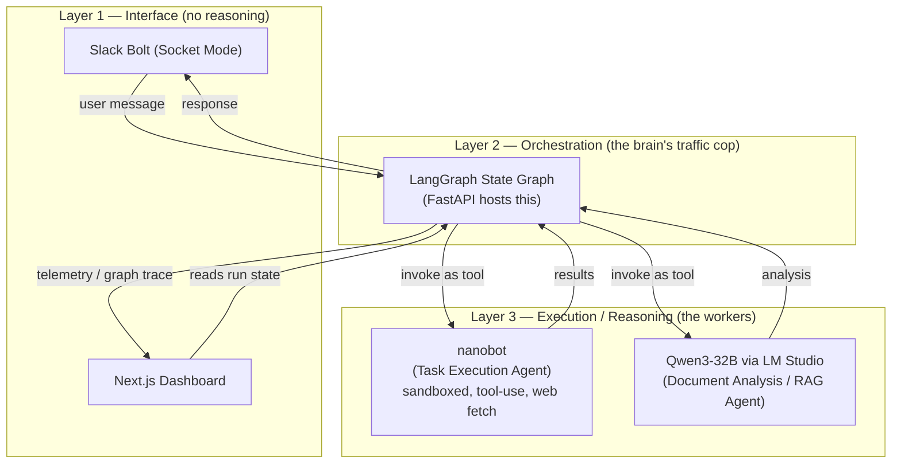
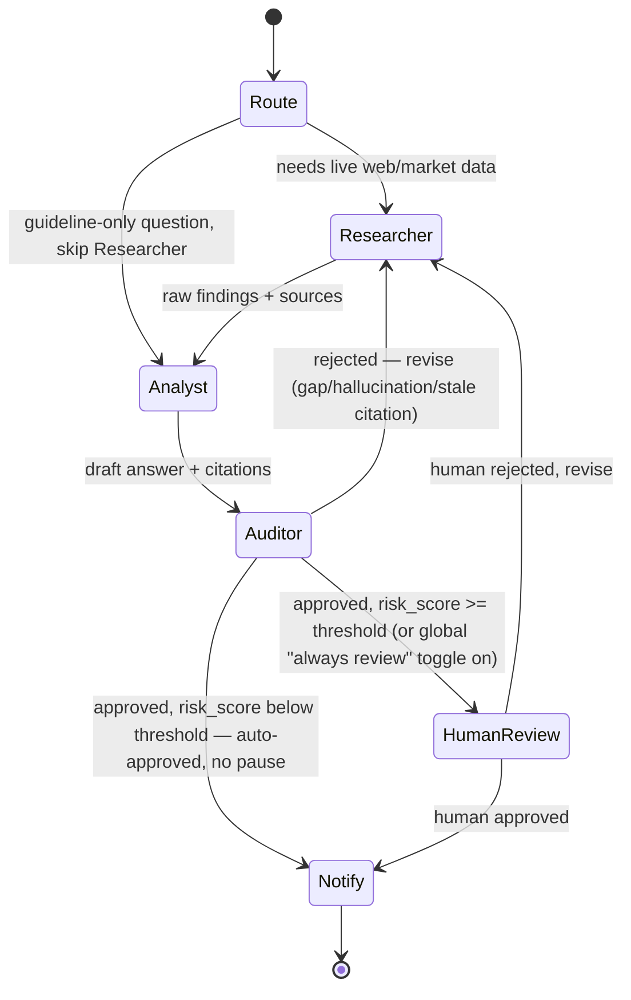

# Teaching AI Agents — Multi-Agent Architecture Plan (Working Draft)

> Status: draft, actively being edited. This extends the Senior Design I "Final Design Document" — specifically the "Multiple Agents / Researcher and Auditor" future-work section — into a concrete, locally-deployed implementation plan.

## 1. What this project actually is

The original design used `nanobot` (Mac Mini) talking to Edgerunner's Qwen models (Mac Studio) over a custom "Garrison API," with Slack as the interface. The "What's Next" section of that doc already named the next evolution: a **Researcher/Auditor multi-agent Critic Loop** with human-in-the-loop review.

This plan is that next phase, made concrete:
- Replace the proprietary Edgerunner/Garrison pairing with our own equivalent (Qwen3-32B via LM Studio) so we're not blocked on getting the physical Mac hardware.
- Turn the implicit "Critic Loop" into an actual LangGraph state machine with named nodes, checkpoints, and a visualizer.
- Everything runs locally — no cloud, ever. Primary target is a single local machine running the whole stack; the two-Mac hardware split (matches what the sponsor actually has) is the backup, not the cloud.

**Important framing:** the sponsor already has their own production solution. This project is a class experiment/demo, not a literal continuation deliverable — we're not obligated to match the original doc's tech choices exactly, just to build something realistic that tells the same story (multi-agent research + audit + human oversight solving the acquisition-research problem). The original doc is used here for justification and vocabulary, not as a spec to satisfy line-by-line.

## 2. The core confusion, resolved: three layers, not a flat list

It's tempting to list Slack, LangGraph, nanobot, and the RAG model as four peers. They aren't. Think in layers:

**Rule of thumb:** if something only moves messages in and out (Slack, the dashboard), it's an interface, not an agent. If something makes a graph-level decision about *what happens next* (retry, escalate to human, route to researcher vs. auditor), it's the orchestrator (LangGraph) — and there's only one of those. If something does actual work when called (fetch a page, run RAG over DAU PDFs), it's a worker agent — a *node* the orchestrator calls, not a peer of it.

This directly maps onto the sponsor's own language: nanobot = "Task Execution Agent," Qwen/RAG = "Document Analysis Agent," and both are things LangGraph calls, the same way nanobot used to call Garrison API to reach Edgerunner.

## 3. LangGraph flow — what happens on every single run

**Key mental model:** the graph is not a persistent thing that "already knows" what to do. It's a decision tree that runs fresh, start to finish, every single time a message comes in from Slack. One Slack message = one trip through the graph.

There are actually **two separate graphs**, not one:
- **IngestionGraph** — short and linear (parse → chunk → embed → store). Triggered by a document showing up, not by a chat message.
- **ConversationGraph** — the Researcher/Auditor/Critic Loop. Triggered by every Slack message. This is the one that matters for the demo.

**How documents get in (fixes an earlier mistake):** the dashboard is read-only — it only displays what's in Postgres, it never accepts input. Documents get uploaded by dragging a PDF into the Slack channel; Slack Bolt sees the file-share event and kicks off IngestionGraph. The dashboard just lights up afterward because Postgres changed underneath it. For the actual 28 guidebooks, easiest path is pre-loading them all with a one-time script before the presentation, and only doing a *live* upload on stage if it's worth the time.

**Walkthrough of one real ConversationGraph run** (using the actual demo question):

1. Someone types in Slack: *"What vendors have recent Space Force contracts for cloud computing under Cloud One?"*
2. **Route** reads the message and decides it needs live web data (not just a document lookup) — sends it toward the Researcher.
3. **Researcher (nanobot)** searches the web, comes back with the SAIC/Cloud One contract findings.
4. **Analyst (Qwen)** takes those findings plus relevant guidebook chunks and drafts a recommendation.
5. **Auditor (Qwen, genuinely separate node and call from the Analyst — decided, see below)** checks the draft against the guidebook's named risks — finds it's missing the vendor-lock-in warning — rejects it.
6. Graph loops back to Researcher/Analyst with that feedback; they revise.
7. Second pass, Auditor approves it and scores it high-risk (this particular case — a vendor lock-in flag on a large contract — should be reviewed by a human).
8. Because it scored above the review threshold, **HumanReview** fires — graph pauses, posts the approved draft to Slack asking a person to confirm.
9. Person approves → graph resumes → **Notify** sends the final answer back to Slack.

**Decision: Auditor and Analyst are genuinely separate, not one call wearing two hats.** Two distinct node functions, two distinct calls with different system prompts — this is deliberate added complexity, not an accident, and it matches the sponsor's own "checks and balances" framing (Figure 20 in the source doc) more literally than collapsing them would. On constrained hardware this doesn't require two loaded models — both nodes can call the same running LM Studio instance, just with different prompts each time. The separation that matters is architectural (two nodes in the graph, two independent judgments), not necessarily two separate model processes.

**Decision: HumanReview is threshold-gated, not automatic every time.** The Auditor's structured output now includes a `risk_score` alongside `is_valid`. A configurable threshold (env var for the MVP, could become a real dashboard toggle later) decides what happens once the Auditor approves something:
- `risk_score` at or above the threshold → route to **HumanReview**, graph pauses for a person.
- `risk_score` below the threshold → skip straight to **Notify**, auto-approved, no pause.

There's also a global override toggle (e.g. "always review" mode) useful for the actual presentation — you can force every run through the visible human-approval gate on demo day even if a given answer would normally auto-approve, so the audience always sees that beat.

A simpler onboarding-only question (no web research needed) takes a *shorter* path through the same graph: Route sends it straight to Analyst, skipping Researcher entirely, since it only needs the guidebooks. Same graph, different route through it depending on what the request actually needs — that's the whole point of Route existing as a node.

| Node | Backed by | Responsibility |
|---|---|---|
| Route | Cheap classifier call or keyword rule | Decide whether this request needs Researcher at all, or goes straight to Analyst |
| Researcher | nanobot | High-recall: web search, pull latest market/regulatory data, sandboxed file ops |
| Analyst | Qwen3-32B (LM Studio) | RAG over the guidebook corpus + Researcher's findings, drafts the answer |
| Auditor | Qwen3-32B, separate node/call from Analyst with its own prompt (decided) | High-precision: checks Analyst's draft against source chunks for hallucinations, stale citations, named guidebook risks. **Must return structured output** `{is_valid, risk_score, issues}`, not free text, so the next edge can branch reliably |
| HumanReview | LangGraph `interrupt()` + Postgres checkpointer | Fires only when `risk_score` clears the configurable threshold (or the global override toggle is on). Pauses the graph (state persists even if this takes minutes), posts to Slack for approval, resumes exactly where it left off when the reply comes in |
| Notify | Slack Bolt | Delivers the final response, writes the closing row to Postgres. Reached directly from Auditor when auto-approved, or from HumanReview once a human signs off |

**Loop guard:** cap revisions (e.g. 2 Researcher↔Auditor round trips) before forcing escalation to HumanReview regardless of Auditor's verdict. Without this, an unlucky live-LLM disagreement could spin indefinitely — bad thing to discover during the actual presentation.

Every node appends a `{node, timestamp, summary}` entry to the run's log before returning. That accumulated log, written to Postgres, is the entire data source for the dashboard — no separate telemetry system needed.

## 4. Component responsibilities (final)

- **Orchestrator — LangGraph (Python):** owns the graph definition, state, conditional routing, and human-in-the-loop interrupts. Runs inside FastAPI as a long-lived process per conversation thread (Slack thread ID = graph thread ID).
- **Task Execution Agent — nanobot:** sandboxed subprocess/container. Only capability: fetch web content, do scoped file I/O in a write-only staging directory. No direct model access — LangGraph feeds it instructions and reads its output.
- **Document Analysis Agent — Qwen3-32B via LM Studio:** exposes an OpenAI-compatible endpoint LangGraph calls like any other tool/model node. This is our own RAG brain, replacing Edgerunner for the class project.
- **Embeddings/Vector Search (decided):** `bge-large-en-v1.5` + pgvector, fully local/offline. No cloud embeddings option — matches the local-only deployment decision in section 5.
- **Backend — FastAPI:** hosts the LangGraph app, Slack webhook receiver (or Socket Mode client), and REST/WebSocket API the dashboard polls/subscribes to.
- **Database — Postgres + pgvector:** document chunks, embeddings, LangGraph checkpoints, run telemetry, compliance scores.
- **Frontend — Next.js + shadcn/ui + Recharts:** renders document repository, compliance/risk breakdowns, the graph trace visualizer, and the audit log stream — all reads against the same Postgres tables LangGraph writes to.
- **Slack — Bolt for Python, Socket Mode:** the only place USSF staff actually type. No business logic lives here.

## 5. Deployment

**Proposed solution — single local machine (primary target):** the whole stack runs on one computer. FastAPI + LangGraph, the nanobot sandbox/container, LM Studio serving the model, PostgreSQL + pgvector, and the local PDF store all live together on the same box. Nothing leaves that machine. This is the realistic target given the team is building on personal devices, not the sponsor's actual hardware.

**Backup #1 — two-node local hardware (matches the sponsor's actual environment):**
- Mac Mini: Slack Bolt + nanobot + FastAPI/LangGraph ("Shield")
- Mac Studio: LM Studio running the model ("Brain" / Garrison-equivalent API)
- Connected over local Ethernet, same air-gap-style separation as the original doc.
- Used only if that physical hardware becomes available to us — otherwise the single-machine plan above is what gets built and demoed.

**There is no cloud option, as a backup or otherwise.** Most class rubrics ask where a project is deployed and implicitly expect "the cloud" as the mature answer. For this project that expectation inverts — cloud hosting would actively undermine the thing being demonstrated. The entire premise, inherited directly from the sponsor's original design, is a Zero Trust, air-gapped system where sensitive acquisition data and model inference never leave controlled, local hardware; the original doc's own "What's Next" section even frames the long-term target as *edge* hardware (small models running on ruggedized/offline devices) — the opposite direction from centralizing in the cloud. So when the presentation is asked "where is this hosted," the honest and correct answer is: **intentionally local/edge by design, running on one machine because that's the realistic and correct proof-of-concept for this specific security model** — not something to be graded as a shortfall.

**Hardware constraint — not everyone on the team can run a large model locally:** Qwen3-32B needs real RAM/VRAM most personal laptops don't have. Rather than block development on whoever has the beefiest machine, use a **tiered model strategy**:
- **Dev/demo tier (default):** a much smaller model from the same family, quantized — e.g. **Qwen2.5-7B-Instruct at 4-bit (Q4_K_M GGUF) via LM Studio**. This runs on a typical modern laptop (~16GB RAM, no dedicated GPU required, just slower on CPU-only) and keeps the same reasoning style the original doc already justified choosing Qwen for. Every team member develops and tests against this tier so the graph is guaranteed to work on whatever machine actually runs the live demo.
- **Aspirational tier:** Qwen3-32B (or larger), reserved for if the sponsor's real Mac Studio hardware — or just whoever has the strongest personal GPU — becomes available. Nice-to-have for demo quality, not a dependency.
- **Watch for this specifically:** smaller/quantized models are less reliable at strict structured JSON output. The Auditor's `{is_valid, risk_score, issues}` response (see section 3) has to be reliably parseable for the Critic Loop and auto-approve threshold to work at all — use LM Studio's JSON-schema/grammar-constrained decoding to force valid structured output regardless of model size, rather than hoping the smaller model free-forms valid JSON on its own.

**Containerization — yes, the whole stack, with one carve-out:** Docker Compose wraps the backend (FastAPI + LangGraph), nanobot's sandbox, and Postgres+pgvector as separate services. This does double duty: it's the security isolation nanobot needs (matches the sponsor's original Docker-sandboxing rationale), and it's what keeps dependency versions identical across every team member's personal machine instead of "works on my laptop" — the same problem you're trying to avoid. **LM Studio itself runs natively on the host, not in a container** — GPU passthrough (Metal on Mac, CUDA on Windows/Linux) into Docker is unreliable across a team with mixed hardware, so the containerized backend just reaches LM Studio's local API over the host network (e.g. `host.docker.internal:<port>`).

## 6. Open questions to resolve before implementation

**Resolved since the last pass (see sections 3, 4, 5 for the actual decisions):** Auditor as a genuinely separate node from Analyst — yes, decided. HumanReview trigger — resolved as a `risk_score` threshold with a global override toggle, not "every run" or "never." Local embeddings — decided, `bge-large-en-v1.5`, no cloud option. Cloud sandbox boundary question — removed; there is no cloud deployment in this plan anymore (section 5).

Still open:
- [ ] Anthropic API vs OpenAI API for nanobot — original doc says the team moved to nanobot specifically because it needed OpenAI's tool format. Confirm that's still the plan before wiring credentials.
- [ ] Exact smaller model + quantization level for the dev/demo tier — confirm `Qwen2.5-7B-Instruct` Q4_K_M actually runs acceptably on the team's least powerful laptop before committing (section 5).
- [ ] Default `risk_score` threshold value, and where the toggle lives (env var for the MVP vs. a real settings table/UI later) — tune once we've seen real Auditor output on real questions.

## 7. Demo Scenario & Script (10–15 min presentation)

**Design principle:** one running scenario threaded through every beat, not four disconnected feature demos. A feature tour is forgettable in 15 minutes; one case study is not.

**Real corpus:** ~28 DAU guideline PDFs we already have (DoD Cloud Acquisition Guidebook, Agile Software Acquisition Guidebook, and others) — these are process/policy guidance, not a specific vendor proposal. That's fine: they ground the *compliance/onboarding* half of the demo. The *market research* half doesn't need pre-loaded documents at all — that's what nanobot's live web search is for, pointed at real public sources (list in section 9).

**Scenario — "New acquisition staffer onboarding onto a cloud acquisition":**

1. **Onboarding question (RAG only, no web needed):** *"Which acquisition pathway applies if we want to buy commercial cloud hosting for a new software program?"* → Analyst answers grounded in the actual Cloud Acquisition Guidebook + Agile Software Acquisition Guidebook.
2. **Live market research (nanobot, real web search):** *"What vendors have recent Space Force contracts for commercial cloud computing services under Cloud One?"* → nanobot searches SAM.gov / USAspending.gov live and surfaces a real, current result: the **Cloud One** program's continuation contract awarded to **SAIC** (~$382.7M, March 2026), plus the active **Cloud One Next (C1N)** follow-on solicitation. Confirmed live and findable as of this writing — not hypothetical.
3. **Compliance synthesis + real Auditor catch:** Analyst drafts a recommendation combining the SAIC/Cloud One finding with guidebook guidance. The Auditor checks it against the Cloud Acquisition Guidebook's explicitly named risks (**vendor lock-in, hidden/consumption-based costs**) and flags that the draft doesn't address them for a large, long-running commercial cloud contract — a genuine catch grounded in the real document, not a staged/fake conflict. Critic Loop fires, Analyst revises, graph visualizer shows the loop live.
4. **Draft outreach to an SME** (e.g. a contracting officer) to flag the lock-in/cost risk on the Cloud One/SAIC contract for review → **human approval gate in Slack** pauses the graph → approved → sent.
5. **One blocked-action security moment:** ask the agent to do something out of its sandbox scope (e.g. read a file outside its staging directory) and show it denied and logged.

**Source links for step 2 (verify still live before the actual presentation date):**
- [Cloud One contract award to SAIC — USAspending](https://www.usaspending.gov/award/CONT_AWD_FA872624F0001_9700_47QTCK18D0001_4732)
- [Cloud One Next (C1N) solicitation — SAM.gov](https://sam.gov/workspace/contract/opp/33c0eee000c74904ab769c907f5f4c70/view)

**Script:**

| Time | Beat | What it proves |
|---|---|---|
| 0:00–1:00 | Frame the problem: acquisition research is slow, staffer onboarding onto a cloud buy | Sets up the story |
| 1:00–3:00 | Drag a guidebook into the Slack channel → IngestionGraph fires → dashboard shows ingestion/chunking/vectorization live (rest of the corpus pre-loaded before the presentation) | Document repository feature |
| 3:00–6:00 | Slack: onboarding question → Analyst answers grounded in the real guidebooks | RAG/Analyst node working |
| 6:00–9:00 | Live market research question → nanobot searches SAM.gov/USAspending and finds the real **Cloud One / SAIC** contract → Analyst drafts a recommendation → **Auditor catches the real vendor-lock-in/hidden-cost gap → Critic Loop fires → graph visualizer shows the loop → corrected answer returns** | The centerpiece: why this isn't "just a chatbot" |
| 9:00–11:00 | Agent drafts SME outreach flagging the Cloud One lock-in risk → **human approval gate in Slack** → approved → sent | Human-in-the-loop / Manual Validation pillar |
| 11:00–13:00 | Dashboard: full run trace, compliance/risk scorecard, audit log → **quick blocked-action security moment** | Auditability + Zero Trust pillars, made visible |
| 13:00–15:00 | Wrap: what this proves for the sponsor's actual problem, what's next | Ties back to why the complexity was worth it |

## 8. Why the complexity is justified (not just decoration)

Every extra piece maps to something the sponsor's own doc already asked for:
- LangGraph's explicit graph ⟶ replaces the vague "Critic Loop" with something the dashboard can actually visualize (sponsor explicitly wants a "Reasoning Graph Visualizer").
- Separate Researcher/Auditor nodes ⟶ directly implements the sponsor's named "checks and balances" pattern (Figure 20 in source doc).
- HITL interrupt as a first-class graph node, not a side channel ⟶ matches "Manual Validation" pillar — human authority stays final, and it's now enforced structurally instead of by convention.
- Full telemetry table backing the dashboard ⟶ implements "Auditability" and "Zero Trust" pillars from the source doc directly, rather than as a bolt-on feature.

If a component doesn't trace back to one of these, cut it.

## 9. Reference links (public data sources)

**Public DAU/acquisition policy sources — to round out our guideline corpus:**
- [DAU.edu](https://www.dau.edu) — source of the guidebooks we already have; browse "Guidebooks" and ACQuipedia for more
- [aap.dau.edu](https://aap.dau.edu) — Adaptive Acquisition Framework hub (same framework diagram cited in the original design doc)
- [acquisition.gov/far](https://www.acquisition.gov/far) — full FAR text, public
- [acquisition.gov/dfars](https://www.acquisition.gov/dfars) — full DFARS text, public
- [esd.whs.mil/DD/DoD-Issuances](https://www.esd.whs.mil/DD/DoD-Issuances/) — DoD directives/instructions

**Public sources for nanobot's live market/vendor research (no scraping concerns, real data):**
- [SAM.gov](https://sam.gov) — public contract opportunities and award data, searchable by keyword/agency
- [USAspending.gov](https://www.usaspending.gov) — searchable federal contract spending; filter by "Space Force" or NAICS code for real vendor names and dollar amounts
- [SpaceWERX](https://spacewerx.us) — USSF's own innovation arm; publicly lists SBIR/STTR topics and awarded companies — most on-theme source for this project
- [AFWERX](https://afwerx.com) — Air Force's equivalent innovation arm, same kind of public award data
- [GSA eLibrary](https://elibrary.gsa.gov) — commercial vendor schedule holders

## 10. Tech Stack & Architecture at a Glance

Everything above in one table — same technologies as the other sections, just collected here for a quick read instead of scattered across the doc.

| Layer | Component | Technology | Role |
|---|---|---|---|
| Interface | Chat | Slack Bolt (Python, Socket Mode) | The only place a human types requests in or reads answers out. No business logic. |
| Interface | Dashboard | Next.js + shadcn/ui + Recharts | Read-only mirror of Postgres — metrics, graph trace, audit log. Never accepts input. |
| Orchestration | Graph engine | LangGraph (Python) | Runs two graphs: **ConversationGraph** (Route → Researcher → Analyst → Auditor → HumanReview → Notify) per Slack message, and **IngestionGraph** (parse → chunk → embed → store) per uploaded document. |
| Orchestration | API/backend | FastAPI | Hosts LangGraph, the Slack integration, and the API the dashboard reads from. |
| Execution | Task Execution Agent | nanobot (sandboxed, Docker) | The "Researcher" node — live web search, scoped file I/O, no direct model access. |
| Execution | Document Analysis Agent | Qwen3-32B (aspirational) / Qwen2.5-7B-Instruct Q4_K_M (dev+demo default) via LM Studio | The "Analyst" and "Auditor" nodes — RAG over the guideline corpus, compliance reasoning, drafts and critiques answers. Two separate calls/prompts, same running model instance. |
| Data | Relational + vector store | PostgreSQL + pgvector | Document chunks, embeddings, LangGraph checkpoints (including paused HumanReview state), run telemetry. |
| Data | Embeddings | `bge-large-en-v1.5` (local — decided, no cloud option) | Turns guideline PDFs into vectors for RAG retrieval. |
| Data | Document processing | pypdf / pdfplumber | Extracts and chunks text from uploaded PDFs during IngestionGraph. |
| Deployment | Primary target | Single local machine — FastAPI/LangGraph, nanobot, LM Studio, Postgres+pgvector, PDF store, all on one computer | The realistic default given the team is building on personal devices, not the sponsor's hardware. |
| Deployment | Backup hardware | Local two-node split — Mac Mini (execution) + Mac Studio (model), matches the sponsor's real environment | Used only if that physical hardware becomes available. No cloud option exists at either tier (section 5). |
| Dev tooling | IDE / VCS / API testing | VS Code (Remote SSH), GitHub, Postman | Standard workflow, not part of the shipped system. |

## 11. Team Roles

**Framing:** these are three ways to divide the work, not fixed assignments locking specific people to specific roles for the whole project. Tasks within each role are up for grabs across the team — this exists so the project has clearly presented roles, not to rigidly silo who touches what.

### Agent Development

Owns the "brain" of the system — everything that makes a request actually get answered.

- **Task Execution Agent (nanobot / "the claw agent"):** wiring it up as the Researcher node — sandboxed web search, scoped file I/O, feeding its findings back into the graph.
- **Document Analysis Agent:** the Qwen model served via LM Studio, the RAG pipeline (chunking, embeddings, pgvector retrieval), and the Analyst + Auditor prompts/personas — including making the Auditor's structured `{is_valid, risk_score, issues}` output reliably parseable (grammar/JSON-schema constrained decoding, especially important on the smaller dev-tier model).
- **LangGraph orchestration:** building both graphs (ConversationGraph and IngestionGraph), the Route classifier, conditional edges, the loop guard, and the auto-approve threshold/toggle logic.
- **Backend glue:** the FastAPI service hosting LangGraph, and the Slack Bolt (Socket Mode) integration that turns Slack messages into graph runs and posts responses/approval prompts back.

### Frontend

Owns everything the dashboard shows — a read-only window into what the backend is already writing to Postgres, nothing more.

- Document repository view (ingestion status, chunking/vectorization metrics).
- Compliance & risk breakdown display.
- LangGraph run trace / reasoning graph visualizer.
- Security & audit log stream.
- The component/visual layer itself: Next.js, shadcn/ui, Lucide icons, Recharts.
- Consuming the FastAPI read endpoints (REST/WebSocket) that expose this data — no direct database access, no business logic living in the frontend.

### Security / Infrastructure

Owns making the workflow actually secure and actually runnable, consistently, across the team.

- **Containerization:** the Docker Compose setup covering the backend (FastAPI+LangGraph), nanobot's sandbox, and Postgres+pgvector as separate services — see section 5's containerization note. This is both the security isolation nanobot needs and the mechanism that keeps dependencies identical across everyone's personal machine.
- **nanobot sandbox hardening:** the scoped write-only staging directory, least-privilege enforcement, and an informal red-team pass confirming it can't escape its boundary (the "blocked-action" demo moment in section 7 depends on this actually working).
- **Local deployment:** getting the single-machine setup running end to end, and documenting/testing the two-node backup path if the sponsor's hardware becomes available.
- **Secrets/config management** and the **audit logging pipeline** — the plumbing that reliably gets every node's `{node, timestamp, summary}` entry (section 3) into Postgres, since that log is the only data source for everything Frontend displays.

## 12. Getting Started (what to install)

**No Garrison API dependency, confirmed:** LangGraph calls LM Studio's local OpenAI-compatible endpoint directly for the Analyst/Auditor nodes, and calls nanobot directly for the Researcher node. Garrison API only appears elsewhere in this doc as a comparison point to the sponsor's original design — nothing here talks to it or needs it.

**Core runtimes**
- Python 3.11+ (FastAPI, LangGraph, Slack Bolt, nanobot)
- Node.js LTS (Next.js dashboard)
- Docker Desktop (runs the backend, nanobot's sandbox, and Postgres+pgvector as containers — section 5's containerization note)
- Git

**The model**
- LM Studio — native install, *not* in Docker (GPU passthrough is unreliable across the team's mixed hardware; see section 5) — with the chosen GGUF model downloaded inside it (`Qwen2.5-7B-Instruct` Q4_K_M for the dev/demo tier)

**Python packages** (inside the backend container/venv)
- `langgraph`, `fastapi`, `uvicorn`
- `slack-bolt` (Socket Mode)
- `pypdf` or `pdfplumber`
- `psycopg2`/`asyncpg` + `pgvector` (Python client)
- `sentence-transformers` (or `FlagEmbedding`) for `bge-large-en-v1.5`
- nanobot itself — pulled from its repo per its own install instructions

**Frontend packages**
- `next`, `react`, `tailwindcss`, `shadcn/ui`, `recharts`

**Accounts/credentials (no payment needed, but setup required)**
- A Slack workspace + a Slack App with Socket Mode enabled (bot token + app token from api.slack.com) — needed before Slack Bolt can connect to anything
- GitHub repo for the team (version control)

**Optional dev tools**
- VS Code (with Remote-SSH if the two-node backup ever gets used)
- Postman (API testing against FastAPI/LM Studio endpoints)
