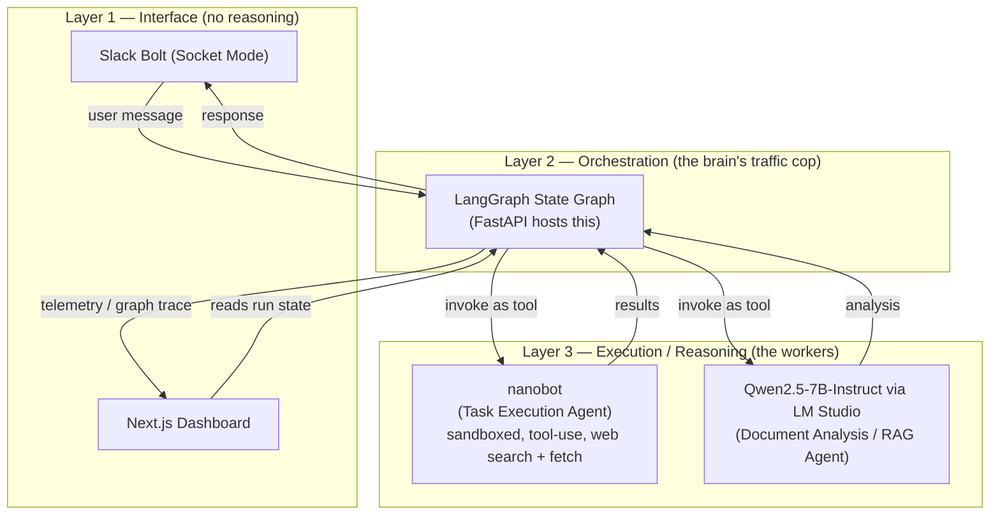
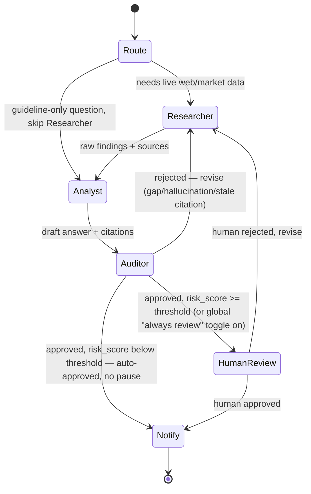

# Teaching AI Agents — Multi-Agent Architecture Plan (Working Draft)

> Status: draft, actively being edited. This extends the Senior Design I "Final Design Document" — specifically the "Multiple Agents / Researcher and Auditor" future-work section — into a concrete, locally-deployed implementation plan.

## 1. What this project actually is

Concretely, this plan:
- Replace the proprietary Edgerunner/Garrison pairing with our own equivalent (Qwen via LM Studio) so we're not blocked on getting the physical Mac hardware.
- Turn the implicit "Critic Loop" into an actual LangGraph state machine with named nodes, checkpoints, and a visualizer.
- Everything runs locally — no cloud, ever. The decided hardware is a single machine — a **Mac Studio (Apple M1 Max chip, 32GB unified memory)** — running the whole stack; the two-Mac hardware split (matches what the sponsor actually has) stays documented only as a contingency, not the cloud.

**Important framing:** the sponsor already has their own production solution. This project is a class experiment/demo, not a literal continuation deliverable — we're not obligated to match the original doc's tech choices exactly, just to build something realistic that tells the same story (multi-agent research + audit + human oversight solving the acquisition-research problem). The original doc is used here for justification and vocabulary, not as a spec to satisfy line-by-line.

## 2. The core confusion, resolved: three layers, not a flat list

It's tempting to list Slack, LangGraph, nanobot, and the RAG model as four peers. They aren't. Think in layers:

**Rule of thumb:** if something only moves messages in and out (Slack, the dashboard), it's an interface, not an agent. If something makes a graph-level decision about *what happens next* (retry, escalate to human, route to researcher vs. auditor), it's the orchestrator (LangGraph) — and there's only one of those. If something does actual work when called (fetch a page, run RAG over DAU PDFs), it's a worker agent — a *node* the orchestrator calls, not a peer of it.

This directly maps onto the sponsor's own language: nanobot = "Task Execution Agent," Qwen/RAG = "Document Analysis Agent," and both are things LangGraph calls, the same way nanobot used to call Garrison API to reach Edgerunner.

## 3. LangGraph flow — what happens on every single run

**Key mental model:** the graph is not a persistent thing that "already knows" what to do. It's a decision tree that runs fresh, start to finish, every single time a message comes in from Slack. One Slack message = one trip through the graph.

There are actually **two separate graphs**, not one:
- **IngestionGraph** — short and linear (parse → chunk → embed → store). Triggered by a document showing up, not by a chat message.
- **ConversationGraph** — the Researcher/Auditor/Critic Loop. Triggered by every Slack message. This is the one that matters for the demo.

**How documents get in (fixes an earlier mistake):** the dashboard is read-only — it only displays what's in Postgres, it never accepts input. Documents get uploaded by dragging a PDF into the Slack channel; Slack Bolt sees the file-share event and kicks off IngestionGraph. The dashboard just lights up afterward because Postgres changed underneath it. For the actual 28 guidebooks, easiest path is pre-loading them all with a one-time script before the presentation, and only doing a *live* upload on stage if it's worth the time.

**Walkthrough of one real ConversationGraph run** (using the actual demo question):

1. Someone types in Slack: *"What vendors have recent Space Force contracts for cloud computing under Cloud One?"*
2. **Route** reads the message and decides it needs live web data (not just a document lookup) — sends it toward the Researcher.
3. **Researcher (nanobot)** searches the web, comes back with the SAIC/Cloud One contract findings.
4. **Analyst (Qwen)** takes those findings plus relevant guidebook chunks and drafts a recommendation.
5. **Auditor (Qwen, genuinely separate node and call from the Analyst — decided, see below)** checks the draft against the guidebook's named risks — finds it's missing the vendor-lock-in warning — rejects it.
6. Graph loops back to Researcher/Analyst with that feedback; they revise.
7. Second pass, Auditor approves it and scores it high-risk (this particular case — a vendor lock-in flag on a large contract — should be reviewed by a human).
8. Because it scored above the review threshold, **HumanReview** fires — graph pauses, posts the approved draft to Slack asking a person to confirm.
9. Person approves → graph resumes → **Notify** sends the final answer back to Slack.

**Decision: Auditor and Analyst are genuinely separate, not one call wearing two hats.** Two distinct node functions, two distinct calls with different system prompts — this is deliberate added complexity, not an accident, and it matches the sponsor's own "checks and balances" framing (Figure 20 in the source doc) more literally than collapsing them would. On constrained hardware this doesn't require two loaded models — both nodes can call the same running LM Studio instance, just with different prompts each time. The separation that matters is architectural (two nodes in the graph, two independent judgments), not necessarily two separate model processes.

**Decision: HumanReview is threshold-gated, not automatic every time — and `risk_score` is computed, not asked of the LLM directly.** Asking a 7B model to freely output a well-calibrated number ("73") is unreliable at that size; instead the Auditor call returns a handful of independently-easy categorical judgments, and a small deterministic function (plain Python, no separate model, nothing trained) turns those into the numeric score:

- `risk_flags` — which items from a short, fixed checklist of named guidebook risks (e.g. `vendor_lock_in`, `hidden_consumption_costs`, `sole_source_justification`, `budget_threshold_exceeded`) the draft leaves unaddressed — the same checklist referenced in the Auditor's row below.
- `citation_issues` — any citation the Auditor couldn't verify against the retrieved chunks (stale/hallucinated).
- `is_valid` — overall pass/fail on the hallucination/citation check.

`risk_score` (0–100) is then summed in code from those fields, capped at 100:
- +40 if any `risk_flags` entry is set
- +25 if `citation_issues` is non-empty
- +20 if a dollar figure above a configurable materiality threshold (default $10M) appears anywhere in the draft or Researcher's findings — a plain regex over the text, not a model judgment
- +15 if the answer used any Researcher (live web) data at all, vs. guidebook-only

**Threshold — decided: `RISK_THRESHOLD = 50`**, env var, MVP-only (no dashboard settings table — out of scope for this project):
- `risk_score >= 50` → route to **HumanReview**, graph pauses for a person.
- `risk_score < 50` → skip straight to **Notify**, auto-approved, no pause.

Sanity check against the demo scenario (section 7): the Cloud One/SAIC answer scores 40 (unaddressed vendor-lock-in flag) + 20 (contract is $382.7M, over the materiality threshold) + 15 (Researcher/live-web data used) = 75 — comfortably over threshold, so HumanReview fires reliably. A guideline-only onboarding answer with no dollar figures and no unaddressed risks scores 0 — comfortably under.

**Toggle — decided: `ALWAYS_REVIEW`**, boolean, default `false`, backed by a live-reloadable value (e.g. a Postgres settings row, not a static env var) so it can be flipped without restarting the stack. Safety-net only: forces every run to **HumanReview** regardless of `risk_score`. Not used in the main demo path — see section 7, the two demo questions already land on both sides of the threshold naturally.

A simpler onboarding-only question (no web research needed) takes a *shorter* path through the same graph: Route sends it straight to Analyst, skipping Researcher entirely, since it only needs the guidebooks. Same graph, different route through it depending on what the request actually needs — that's the whole point of Route existing as a node.

| Node | Backed by | Responsibility |
|---|---|---|
| Route | Cheap classifier call or keyword rule | Decide whether this request needs Researcher at all, or goes straight to Analyst |
| Researcher | nanobot — its own tool-call reasoning is backed by Qwen2.5-7B-Instruct via LM Studio (same local endpoint as Analyst/Auditor, no external API) | High-recall: web search, pull latest market/regulatory data, sandboxed file ops |
| Analyst | Qwen2.5-7B-Instruct (LM Studio) | RAG over the guidebook corpus + Researcher's findings, drafts the answer |
| Auditor | Qwen2.5-7B-Instruct, separate node/call from Analyst with its own prompt (decided), given an explicit checklist of named guidebook risks to check against rather than open-ended critique (a 7B model catches named items reliably; it's not trusted to notice subtle gaps unprompted). Optional stretch: bump just this node to Qwen2.5-14B-Instruct via LM Studio if 7B+checklist proves unreliable in testing — see section 5 | High-precision: checks Analyst's draft against source chunks for hallucinations, stale citations, named guidebook risks. **Must return structured output** `{is_valid, risk_flags, citation_issues}`, not free text — `risk_score` is then computed deterministically from these fields (see section 3's threshold decision), so the next edge can branch reliably |
| HumanReview | LangGraph `interrupt()` + Postgres checkpointer | Fires only when `risk_score` clears the configurable threshold (or the global override toggle is on). Pauses the graph (state persists even if this takes minutes), posts the draft **and the risk_score breakdown** (which flags/checks triggered it) to Slack for approval, resumes exactly where it left off when the reply comes in |
| Notify | Slack Bolt | Delivers the final response, writes the closing row to Postgres. Reached directly from Auditor when auto-approved, or from HumanReview once a human signs off |

**Loop guard:** cap revisions (e.g. 2 Researcher↔Auditor round trips) before forcing escalation to HumanReview regardless of Auditor's verdict. Without this, an unlucky live-LLM disagreement could spin indefinitely — bad thing to discover during the actual presentation.

Every node appends a `{node, timestamp, summary}` entry to the run's log before returning. That accumulated log, written to Postgres, is the entire data source for the dashboard — no separate telemetry system needed.

## 4. Component responsibilities (final)

- **Orchestrator — LangGraph (Python):** owns the graph definition, state, conditional routing, and human-in-the-loop interrupts. Runs inside FastAPI as a long-lived process per conversation thread (Slack thread ID = graph thread ID).
- **Task Execution Agent — nanobot:** sandboxed subprocess/container. Only capability: web search + fetch web content, do scoped file I/O in a write-only staging directory. Its own tool-call reasoning loop (deciding what to search, when it has enough) is backed by the same local Qwen2.5-7B-Instruct/LM Studio endpoint the Analyst and Auditor use, not a separate OpenAI/Anthropic API — LangGraph still feeds it the task and reads its output, but nanobot's internal decisions are its own local-model calls, not an external API dependency.
- **Document Analysis Agent — Qwen2.5-7B-Instruct via LM Studio:** exposes an OpenAI-compatible endpoint LangGraph calls like any other tool/model node. This is our own RAG brain, replacing Edgerunner for the class project.
- **Embeddings/Vector Search (decided):** `bge-large-en-v1.5` + pgvector, fully local/offline. No cloud embeddings option — matches the local-only deployment decision in section 5.
- **Backend — FastAPI:** hosts the LangGraph app, Slack webhook receiver (or Socket Mode client), and a REST API the dashboard polls. No WebSocket layer — polling is sufficient for a single-viewer demo.
- **Database — Postgres + pgvector (via `psycopg` v3, the same driver LangGraph's own checkpointer uses; use the `pgvector/pgvector` Postgres image so the extension is preinstalled, no manual `CREATE EXTENSION` step):** five tables back everything the dashboard shows — `documents` (filename, status, chunk count — the ingestion repository view), `chunks` (text + embeddings, pgvector), `conversation_runs` (question, final answer, `risk_score`, `risk_flags`, `citation_issues`, human-review status — the compliance/risk breakdown), `run_log` (the per-node `{node, timestamp, summary}` entries from section 3 — source for both the graph trace visualizer and the audit log stream), and `app_settings` (single row, `always_review boolean` — the live-reloadable HumanReview override from section 3; flipping it needs no restart).
- **Frontend — Next.js + shadcn/ui + Recharts:** renders document repository, compliance/risk breakdowns, the graph trace visualizer, and the audit log stream, each reading one of the tables above via the FastAPI REST endpoint (polled every 1–2s while a run is in-flight, plain `fetch` — no extra data-fetching library needed). Graph trace visualizer: every node starts unlit; each becomes lit/completed the moment its `run_log` entry appears — no single "currently active" highlight, just an accumulating trail of what's finished. A loop-back (e.g. Auditor → Researcher) re-lighting an already-completed node just bumps a small counter badge on it rather than resetting its state.
- **Slack — Bolt for Python, Socket Mode:** the only place USSF staff actually type. No business logic lives here.

## 5. Deployment

**Decided hardware — single machine:** a **Mac Studio (Apple M1 Max chip, 32GB unified memory)**. The whole stack runs on this one computer — FastAPI + LangGraph, the nanobot sandbox/container, LM Studio serving the model, PostgreSQL + pgvector, and the local PDF store all live together on the same box. Nothing leaves that machine.

**Backup #1 — two-node local hardware (matches the sponsor's actual environment), contingency only:**
- Mac Mini: Slack Bolt + nanobot + FastAPI/LangGraph ("Shield")
- Mac Studio: LM Studio running the model ("Brain" / Garrison-equivalent API) — the decided machine above would slot directly into this role if a Mac Mini half ever becomes available.
- Connected over local Ethernet, same air-gap-style separation as the original doc.
- Used only if that additional physical hardware becomes available to us — otherwise the single-machine plan above is what gets built and demoed.

**There is no cloud option, as a backup or otherwise.**

**Model — decided: Qwen2.5-7B-Instruct, 4-bit (Q4_K_M GGUF), served via LM Studio.** Runs comfortably within the Mac Studio's 32GB unified memory alongside Docker Desktop, Postgres+pgvector, and the rest of the stack. One running instance backs all three reasoning roles in the graph — Analyst, Auditor, and nanobot's own tool-call reasoning as the Researcher — each a separate call with its own prompt against the same local endpoint, so there's no separate model to install per role and no external API key or credits anywhere in the stack.

**Optional stretch, Auditor only:** if testing shows the 7B Auditor (even with the named-risk checklist from section 3) isn't reliable enough, bump just that node to Qwen2.5-14B-Instruct via LM Studio, loaded just-in-time rather than kept resident alongside the 7B model — trades a few seconds of load latency on the Analyst→Auditor handoff for not doubling steady-state memory pressure on the 32GB machine. Not pursued unless the 7B+checklist combination actually falls short in testing.

**Containerization — yes, the whole stack, with one carve-out:** Docker Compose wraps the backend (FastAPI + LangGraph), nanobot's sandbox, and Postgres+pgvector as separate services. This is both the security isolation nanobot needs (matches the sponsor's original Docker-sandboxing rationale) and what keeps dependency versions identical between whatever machine a team member develops on and the decided Mac Studio that actually runs the demo. **LM Studio itself runs natively on the host, not in a container** — Metal GPU passthrough into Docker is unreliable on Apple Silicon, so both the backend container and nanobot's sandbox container reach LM Studio's local API over the host network (e.g. `host.docker.internal:<port>`).

## 6. Open questions — resolved

Every open question from earlier passes is now decided (see sections 3, 4, 5 for the source of each): Auditor as a genuinely separate node from Analyst — yes. HumanReview trigger — a computed `risk_score` threshold (`RISK_THRESHOLD=50`, env var) plus a global `ALWAYS_REVIEW` override toggle (a live-reloadable row in the `app_settings` table, not an env var, so it can be flipped without a restart) (sections 3, 4). `risk_score` itself — computed deterministically in code from the Auditor's categorical judgments (named-risk checklist flags, citation issues) plus a cheap dollar-amount regex check, not asked of the LLM as a raw number and not backed by any separately trained model (section 3). Local embeddings — `bge-large-en-v1.5`, no cloud option. Cloud sandbox boundary — removed; there is no cloud deployment in this plan (section 5). Hardware — a single Mac Studio (Apple M1 Max chip, 32GB unified memory) (section 5). Model — Qwen2.5-7B-Instruct Q4_K_M via LM Studio for Analyst, Auditor, and nanobot's Researcher-side reasoning, with an optional Qwen2.5-14B-Instruct stretch for the Auditor only if 7B+checklist testing shows it's insufficient (section 5). Nanobot's LLM backend — neither Anthropic's nor OpenAI's API; nanobot points at the same local LM Studio endpoint as everything else, so no external API key or credits exist anywhere in the stack (sections 4, 5).

## 7. Demo Scenario & Script (10–15 min presentation)

**Design principle:** one running scenario threaded through every beat, not four disconnected feature demos. A feature tour is forgettable in 15 minutes; one case study is not.

**Real corpus:** ~28 DAU guideline PDFs we already have (DoD Cloud Acquisition Guidebook, Agile Software Acquisition Guidebook, and others) — these are process/policy guidance, not a specific vendor proposal. That's fine: they ground the *compliance/onboarding* half of the demo. The *market research* half doesn't need pre-loaded documents at all — that's what nanobot's live web search is for, pointed at real public sources (list in section 9).

**Scenario — "New acquisition staffer onboarding onto a cloud acquisition":**

1. **Onboarding question (RAG only, no web needed):** *"Which acquisition pathway applies if we want to buy commercial cloud hosting for a new software program?"* → Analyst answers grounded in the actual Cloud Acquisition Guidebook + Agile Software Acquisition Guidebook.
2. **Live market research (nanobot, real web search):** *"What vendors have recent Space Force contracts for commercial cloud computing services under Cloud One?"* → nanobot searches SAM.gov / USAspending.gov live and surfaces a real, current result: the **Cloud One** program's continuation contract awarded to **SAIC** (~$382.7M, March 2026), plus the active **Cloud One Next (C1N)** follow-on solicitation. Confirmed live and findable as of this writing — not hypothetical.
3. **Compliance synthesis + real Auditor catch:** Analyst drafts a recommendation combining the SAIC/Cloud One finding with guidebook guidance. The Auditor checks it against the Cloud Acquisition Guidebook's explicitly named risks (**vendor lock-in, hidden/consumption-based costs**) and flags that the draft doesn't address them for a large, long-running commercial cloud contract — a genuine catch grounded in the real document, not a staged/fake conflict. Critic Loop fires, Analyst revises, graph visualizer shows the loop live.
4. **Draft outreach to an SME** (e.g. a contracting officer) to flag the lock-in/cost risk on the Cloud One/SAIC contract for review → **human approval gate in Slack** pauses the graph → approved → sent.
5. **One blocked-action security moment:** ask the agent to do something out of its sandbox scope (e.g. read a file outside its staging directory) and show it denied and logged.

**Auto-approve vs. pause — demonstrated by the script as written, no toggle needed:** step 1 scores ~0 (no dollar figure, no risk flag) and goes straight to Notify; step 3 scores ~75 (unaddressed vendor-lock-in flag + $382.7M contract + live-web data) and triggers HumanReview. Same run, both outcomes shown. Rehearse both once beforehand to confirm the split holds. `ALWAYS_REVIEW` stays off during the demo — it's a fallback only (section 3).

**Source links for step 2 (verify still live before the actual presentation date):**
- [Cloud One contract award to SAIC — USAspending](https://www.usaspending.gov/award/CONT_AWD_FA872624F0001_9700_47QTCK18D0001_4732)
- [Cloud One Next (C1N) solicitation — SAM.gov](https://sam.gov/workspace/contract/opp/33c0eee000c74904ab769c907f5f4c70/view)

**Script:**

| Time | Beat | What it proves |
|---|---|---|
| 0:00–1:00 | Frame the problem: acquisition research is slow, staffer onboarding onto a cloud buy | Sets up the story |
| 1:00–3:00 | Drag a guidebook into the Slack channel → IngestionGraph fires → dashboard shows ingestion/chunking/vectorization live (rest of the corpus pre-loaded before the presentation) | Document repository feature |
| 3:00–6:00 | Slack: onboarding question → Analyst answers grounded in the real guidebooks | RAG/Analyst node working |
| 6:00–9:00 | Live market research question → nanobot searches SAM.gov/USAspending and finds the real **Cloud One / SAIC** contract → Analyst drafts a recommendation → **Auditor catches the real vendor-lock-in/hidden-cost gap → Critic Loop fires → graph visualizer shows the loop → corrected answer returns** | The centerpiece: why this isn't "just a chatbot" |
| 9:00–11:00 | Agent drafts SME outreach flagging the Cloud One lock-in risk → **human approval gate in Slack** → approved → sent | Human-in-the-loop / Manual Validation pillar |
| 11:00–13:00 | Dashboard: full run trace, compliance/risk scorecard, audit log → **quick blocked-action security moment** | Auditability + Zero Trust pillars, made visible |
| 13:00–15:00 | Wrap: what this proves for the sponsor's actual problem, what's next | Ties back to why the complexity was worth it |

## 8. Why the complexity is justified (not just decoration)

Every extra piece maps to something the sponsor's own doc already asked for:
- LangGraph's explicit graph ⟶ replaces the vague "Critic Loop" with something the dashboard can actually visualize (sponsor explicitly wants a "Reasoning Graph Visualizer").
- Separate Researcher/Auditor nodes ⟶ directly implements the sponsor's named "checks and balances" pattern (Figure 20 in source doc).
- HITL interrupt as a first-class graph node, not a side channel ⟶ matches "Manual Validation" pillar — human authority stays final, and it's now enforced structurally instead of by convention.
- Full telemetry table backing the dashboard ⟶ implements "Auditability" and "Zero Trust" pillars from the source doc directly, rather than as a bolt-on feature.

If a component doesn't trace back to one of these, cut it.

## 9. Reference links (public data sources)

**Public DAU/acquisition policy sources — to round out our guideline corpus:**
- [DAU.edu](https://www.dau.edu) — source of the guidebooks we already have; browse "Guidebooks" and ACQuipedia for more
- [aap.dau.edu](https://aap.dau.edu) — Adaptive Acquisition Framework hub (same framework diagram cited in the original design doc)
- [acquisition.gov/far](https://www.acquisition.gov/far) — full FAR text, public
- [acquisition.gov/dfars](https://www.acquisition.gov/dfars) — full DFARS text, public
- [esd.whs.mil/DD/DoD-Issuances](https://www.esd.whs.mil/DD/DoD-Issuances/) — DoD directives/instructions

**Public sources for nanobot's live market/vendor research (no scraping concerns, real data):**
- [SAM.gov](https://sam.gov) — public contract opportunities and award data, searchable by keyword/agency
- [USAspending.gov](https://www.usaspending.gov) — searchable federal contract spending; filter by "Space Force" or NAICS code for real vendor names and dollar amounts
- [SpaceWERX](https://spacewerx.us) — USSF's own innovation arm; publicly lists SBIR/STTR topics and awarded companies — most on-theme source for this project
- [AFWERX](https://afwerx.com) — Air Force's equivalent innovation arm, same kind of public award data
- [GSA eLibrary](https://elibrary.gsa.gov) — commercial vendor schedule holders

**nanobot's web search/fetch config — decided, cost-free:** search provider `duckduckgo` (built into nanobot, no API key, no cost), with the Researcher's queries scoped to the sources above via DuckDuckGo's `site:` operator (e.g. `site:usaspending.gov SAIC Cloud One Space Force`) — no custom API integration needed to target a specific source. Fetch/page-to-markdown set to local-only (`useJinaReader: false`, falls back to `readability-lxml`), so no third-party fetch service is called either — the only outbound calls are to the target sites themselves.

## 10. Tech Stack & Architecture at a Glance

Everything above in one table — same technologies as the other sections, just collected here for a quick read instead of scattered across the doc.

| Layer | Component | Technology | Role |
|---|---|---|---|
| Interface | Chat | Slack Bolt (Python, Socket Mode) | The only place a human types requests in or reads answers out. No business logic. |
| Interface | Dashboard | Next.js + shadcn/ui + Recharts | Read-only mirror of Postgres — metrics, graph trace, audit log. Never accepts input. |
| Orchestration | Graph engine | LangGraph (Python) | Runs two graphs: **ConversationGraph** (Route → Researcher → Analyst → Auditor → HumanReview → Notify) per Slack message, and **IngestionGraph** (parse → chunk → embed → store) per uploaded document. |
| Orchestration | API/backend | FastAPI | Hosts LangGraph, the Slack integration, and the API the dashboard reads from. |
| Execution | Task Execution Agent | nanobot (sandboxed, Docker), its own tool-call reasoning backed by Qwen2.5-7B-Instruct via LM Studio | The "Researcher" node — live web search, scoped file I/O. |
| Execution | Document Analysis Agent | Qwen2.5-7B-Instruct Q4_K_M via LM Studio (decided model; optional Qwen2.5-14B-Instruct stretch for Auditor only, see section 5) | The "Analyst" and "Auditor" nodes — RAG over the guideline corpus, compliance reasoning, drafts and critiques answers. Two separate calls/prompts, same running model instance. |
| Data | Relational + vector store | PostgreSQL + pgvector, `psycopg` v3 driver | `documents`, `chunks`, `conversation_runs`, `run_log`, `app_settings` tables (section 4) — chunks/embeddings, LangGraph checkpoints (including paused HumanReview state), run telemetry, live-reloadable toggles. |
| Data | Embeddings | `bge-large-en-v1.5` (local — decided, no cloud option) | Turns guideline PDFs into vectors for RAG retrieval. |
| Data | Document processing | pypdf | Extracts and chunks text from uploaded PDFs during IngestionGraph. |
| Deployment | Decided hardware | Mac Studio (Apple M1 Max chip, 32GB unified memory) — FastAPI/LangGraph, nanobot, LM Studio, Postgres+pgvector, PDF store, all on one machine | The single machine the project is built and demoed on. |
| Deployment | Backup hardware (contingency) | Local two-node split — Mac Mini (execution) + Mac Studio (model), matches the sponsor's real environment; the decided Mac Studio above would fill the "model" role | Used only if a Mac Mini half also becomes available. No cloud option exists at either tier (section 5). |
| Dev tooling | IDE / VCS / API testing | VS Code (Remote SSH), GitHub, Postman | Standard workflow, not part of the shipped system. |

## 11. Getting Started (what to install)

**Core runtimes**
- Python 3.11+ (FastAPI, LangGraph, Slack Bolt, nanobot)
- Node.js LTS (Next.js dashboard)
- Docker Desktop (runs the backend, nanobot's sandbox, and Postgres+pgvector as containers — section 5's containerization note)
- Git

**The model**
- LM Studio — native install, *not* in Docker (Metal GPU passthrough is unreliable on Apple Silicon; see section 5) — with `Qwen2.5-7B-Instruct` Q4_K_M downloaded inside it, the decided model backing Analyst, Auditor, and nanobot's Researcher-side reasoning

**Python packages** (inside the backend container/venv)
- `langgraph`, `langgraph-checkpoint-postgres`, `fastapi`, `uvicorn`
- `slack-bolt` (Socket Mode)
- `openai` — calls LM Studio's OpenAI-compatible endpoint for Analyst/Auditor/nanobot's reasoning; no LangChain dependency needed
- `pypdf` — PDF text extraction for IngestionGraph
- `psycopg[binary,pool]` (v3) + `pgvector` — one driver for both LangGraph's checkpointer and the app's own queries (`documents`, `chunks`, `conversation_runs`, `run_log`)
- `sentence-transformers` for `bge-large-en-v1.5`
- `pydantic-settings` — loads `RISK_THRESHOLD` and other startup config (not `ALWAYS_REVIEW` — that's a live-reloadable row in `app_settings`, section 4, not an env var)
- nanobot itself — pulled from its repo per its own install instructions

**Frontend packages**
- `next`, `react`, `tailwindcss`, `shadcn/ui`, `recharts`

**Accounts/credentials (no payment needed, but setup required)**
- A Slack workspace + a Slack App with Socket Mode enabled (bot token + app token from api.slack.com) — needed before Slack Bolt can connect to anything
- GitHub repo (version control)
- No OpenAI/Anthropic account or API key needed anywhere in this stack — nanobot and the Analyst/Auditor nodes all run against the same local LM Studio endpoint (section 5)
- No web-search API key either — nanobot's search (DuckDuckGo) and fetch (local `readability-lxml`) both work with no account (section 9)
